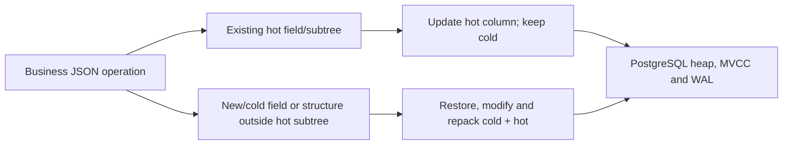

# JSON update design and workload selection

**English** | [简体中文](design-rationale.zh-CN.md) · [Documentation](README.md)

This guide explains the design choices of **PostgreSQL Split JSON Storage Extension (PG SplitJSON) 0.2.0**. Its starting point is Yin Haiwen's (尹海文, 胖头鱼的鱼缸) article, [“胖头鱼的技术专栏-468 JSON改一个字段，凭什么要重写整篇？（20260910）”](https://blog.csdn.net/yhw1809/article/details/164757146), published on 2026-09-10. The article discusses frequent updates, write amplification, JSON access over relational storage, and extracting frequently changed fields. This guide develops those ideas for the implemented PostgreSQL extension; the [validation report](validation.md) remains the source of project measurements.

## From the article to PG SplitJSON

The useful design question is how much unchanged data the storage engine must process when a small field changes. Product stock and prices, order state, game inventories and logistics events make this concrete: their fields differ in update frequency, size, read patterns and atomicity requirements. Representing them in one JSON document does not require storing all of them as one changing value.

The article's PostgreSQL alternative extracts frequently changed fields into ordinary columns and retains semistatic attributes in JSONB. Its discussion of JSON Relational Duality Views also highlights a broader idea: JSON can be an application interface over relational storage. PG SplitJSON applies that idea to declared object and fixed array paths within one row. It keeps the cold document template and stores each present hot value once in a separate column, reconstructing the document through a business view.

| Design idea from the article | Implementation in 0.2.0 | Boundary |
| --- | --- | --- |
| Separate frequently changed fields from large attributes | Declared hot JSONB columns plus a cold template | Existing hot fields/subtrees use dedicated APIs |
| Keep JSON convenient at the application boundary | View exposes a complete doc and business columns | Full reads reconstruct doc; integration uses explicit APIs |
| Query physical columns directly | Helpers, automatic constant-path SELECT rewriting and JSONB/text B-trees | Load module before planning; unsupported forms retain native behavior |
| Avoid two authoritative copies of the same value | Present hot paths hold placeholders, not duplicated values | Fallback writes synchronize template and hot columns transactionally |
| Model independently changing collection members separately | Ordinary relational tables can hold per-item/per-event rows | Automatic array-to-child-table mapping is not implemented |

This is a focused split-storage extension. General duality views are outside the project's scope, rather than a future feature. JSON Patch translation, ETags and cross-table JSON assembly are not provided. `set_fields` has its own ordered `path`/`value` format; it is neither RFC 6902 JSON Patch nor RFC 7396 JSON Merge Patch.

## What changes physically

For a real value change, PostgreSQL 18 `jsonb_set` constructs a resulting JSONB value. Changing SQL syntax to `MERGE` or moving a key to the top level of the **same JSONB value** does not establish a physical partial-write guarantee. PG SplitJSON changes the storage boundary by moving the field into a different heap column.

MVCC and TOAST explain two separate costs. An UPDATE creates a new heap row version; unchanged out-of-line values can normally retain their TOAST pointers. Updating the JSONB value itself may require processing and storing a new large value, whereas updating only a separate column can leave the large cold value untouched. The [PG18 TOAST documentation](https://www.postgresql.org/docs/18/storage-toast.html) describes unchanged-value reuse; PG SplitJSON uses this existing mechanism rather than bypassing MVCC.



A “hot field” is the extension's frequently updated field. PostgreSQL **HOT** means Heap-Only Tuple optimization and has separate requirements: indexed columns must not change, subject to the summarizing-index exception, and the new tuple must fit on the same page. A B-tree on a changed hot column may prevent HOT while still allowing cold TOAST reuse. Smaller cold writes therefore do not imply zero WAL, zero index work, zero row versions or no vacuum requirement. See [PG18 HOT](https://www.postgresql.org/docs/18/storage-hot.html) and the project's [physical validation](validation.md).

## Choose the storage model

| Model | Good fit | Update and query trade-off |
| --- | --- | --- |
| Native JSONB | Small or mostly static documents; updates already meet requirements | Simple native JSON operators and indexes; changed documents use the native JSONB write path |
| Explicit ordinary columns plus JSONB | Stable schema, typed constraints and direct SQL access are priorities | Applications or a purpose-built view assemble JSON; hot columns can change without assigning JSONB |
| PG SplitJSON | Large semistatic payload, a few known hot object/array paths, JSON-facing applications | Existing hot APIs preserve cold; full reads and structural edits reconstruct the document; queries use helpers or supported rewrites |
| Normalized child tables plus a JSON projection | Arrays or related entities change independently | Per-item/per-event rows can isolate writes and locks; projection and update mapping must be designed separately |

A workload with small documents and rare updates may gain little from the extra layout and reconstruction. A workload dominated by replacing the whole document or appending large arrays often takes the fallback path. For such cases, evaluate ordinary JSONB or separate relational rows before adopting the extension. The article's cross-database discussion informs these design dimensions; this guide does not rank MongoDB or Oracle versions using unverified storage or throughput claims.

## Select hot paths by workload

Start with measured update frequency, cold payload size, field presence and read patterns. Prefer stable, usually present object or fixed array paths with small frequently changing values. A rarely present registered field takes the repack path on first creation. A large object or array used as one hot value still rewrites that hot value when replaced; choose a smaller leaf path when its updates dominate.

Only index hot paths that need equality searches. A storage declaration creates separate columns; it does not create a search index. B-tree maintenance is a cost paid on updates, so compare the query benefit against update frequency. Use `get_field` when only one field is needed to avoid full-document reconstruction.

| Workload from the article | Candidate hot paths | Content or model to consider separately |
| --- | --- | --- |
| Product/SKU | stock, price, status | Descriptions/specifications remain cold; tenant/SKU identifiers can be typed business columns |
| Order document | state, stats.retry_count | Large order snapshots remain cold; related item rows may belong in separate tables |
| Game inventory | summary.count, summary.version | Fixed leaves or whole hot-array subtrees support updates; independent element locks require separate rows |
| Logistics | latest.state, latest.timestamp | Frequently appended history still rewrites its value; consider an event table |
| Semistatic configuration | Only fields shown to be frequent | Ordinary JSONB may be sufficient when updates are rare |

Hot paths cannot overlap. Declaring both `stats` and `stats.count` is invalid; choose the unit you intend to replace. Updating a hot parent uses fallback; descendants inside an existing hot object/array can update that hot column alone. Dynamic layout changes are not supported in 0.2.0, so choose paths before loading data and use a newly managed target for a later layout migration.

Separate hot columns remain in the **same heap row**. Updates to stock and status on the same ID serialize on a row lock; this design reduces cold writes, not same-row lock contention. For independently writable items, consider separate rows. Dedicated numeric increments are atomic, but they do not by themselves enforce nonnegative stock, price scale or other business invariants. For database-enforced rules, consider an explicitly constrained relational model or suitable domain-backed business columns, and design validation for JSON updates. Hot JSONB values are not automatically converted to those column types.

## Product example

In a test database with the extension installed, run as the installer. These example names are independent of the README and API examples. The small payload illustrates routing rather than performance.

```sql
SELECT splitjson.create_table('public.catalog_items',
    '[["stock"],["price"],["status"]]',
    '{"tenant_id":"bigint","sku":"text"}');

INSERT INTO public.catalog_items(id, doc, tenant_id, sku)
VALUES (1,
    '{"stock":100,"price":19.9,"status":"draft","specs":{"color":"blue","size":"M"},"description":"cold product details"}',
    10, 'SKU-001');

-- Existing hot values: increment stock and batch price/status without changing cold.
SELECT splitjson.increment_field('public.catalog_items', 1, ARRAY['stock'], 5);
SELECT splitjson.set_fields('public.catalog_items', 1,
    '[{"path":["price"],"value":21.5},{"path":["status"],"value":"active"}]');

SELECT splitjson.create_path_index('public.catalog_items', 'catalog_status_idx', ARRAY['status']);
SELECT id, sku FROM public.catalog_items
WHERE id IN (SELECT splitjson.find_ids('public.catalog_items', ARRAY['status'], '"active"'));
SELECT splitjson.get_field('public.catalog_items', 1, ARRAY['stock']);

-- Cold change: restore and repack while retaining the updated stock, price and status.
SELECT splitjson.set_field('public.catalog_items', 1, ARRAY['specs','color'], '"green"');
SELECT doc FROM public.catalog_items WHERE id = 1;
```

The returned document has stock 105, price 21.5, status active and color green. No full JSON value is assembled in the application for these field updates. Missing intermediate objects still follow `jsonb_set` semantics; this example already contains `specs`.

## Observe the physical tables

The article's vacuum and bloat concerns still apply to the extension. Observe the **private heap table**, not just its business view. The following read-only query is for the installer because the mapping metadata is private. Continue from the product example; keep application roles away from metadata and private tables.

```sql
SELECT m.view_name, m.storage_name,
       s.n_tup_upd, s.n_tup_hot_upd, s.n_tup_newpage_upd,
       s.n_dead_tup, s.last_autovacuum,
       pg_total_relation_size(s.relid) AS total_bytes
FROM splitjson._tables AS m
JOIN pg_stat_user_tables AS s ON s.relid = to_regclass(m.storage_name)
WHERE m.view_name = 'public.catalog_items';
```

`n_tup_upd` counts row updates, including HOT updates; `n_tup_hot_upd` counts HOT updates, and `n_tup_newpage_upd` counts successor tuples on another heap page. `n_dead_tup` is an estimate, not a precise instantaneous bloat measurement. Compare counter differences over a representative interval; statistics may be delayed or cached. `pg_total_relation_size` includes the table, its indexes and TOAST storage. Refer to [PG18 statistics](https://www.postgresql.org/docs/18/monitoring-stats.html).

Choose autovacuum settings for the actual update rate, table size, long-lived snapshots and available I/O. Lowering `autovacuum_vacuum_scale_factor` can trigger vacuum sooner; it does not remove JSONB reconstruction costs or guarantee no bloat. The implementation creates private tables with fillfactor 70 to leave update space, but that does not guarantee HOT. A fixed 4 KiB document limit or a universal scale factor such as 0.05 is not an extension rule. TOAST decisions depend on row width, compressibility and storage settings. See [PG18 routine vacuuming](https://www.postgresql.org/docs/18/routine-vacuuming.html).

## Evaluate the complete workload

Compare native JSONB, explicit column separation and PG SplitJSON using equivalent data and indexes. Measure single-field, all-hot batch, mixed/structural updates and full-document reads. Include independent commits, concurrent writers on the same and different IDs, and indexed vs unindexed hot columns. The existing [WAL comparison](validation.md) measures one specific workload, not these entire dimensions.

Track latency and throughput, WAL bytes, heap/index/TOAST size, HOT rates, lock waits and vacuum behavior over time. Verify that the application's updates actually qualify for the fast path, and inspect `explain_find_ids` for query plans. WAL records, WAL bytes, dirty blocks and physical device writes are different measures; third-party record counts or block counts are not directly comparable to this project's WAL-byte benchmark.


For implemented array operations, query forms and fallback boundaries, see the [array and query guide](roadmap.md).

## Sources

- [Yin Haiwen's original article, 2026-09-10](https://blog.csdn.net/yhw1809/article/details/164757146): workload examples, field extraction and JSON as an access layer.
- [PostgreSQL 18 JSON types](https://www.postgresql.org/docs/18/datatype-json.html): JSONB and whole-row concurrency considerations.
- [PostgreSQL 18 TOAST](https://www.postgresql.org/docs/18/storage-toast.html) and [HOT](https://www.postgresql.org/docs/18/storage-hot.html): unchanged external values and heap-update/index costs.
- [PostgreSQL 18 branch, jsonfuncs.c](https://github.com/postgres/postgres/blob/REL_18_STABLE/src/backend/utils/adt/jsonfuncs.c): jsonb_set constructs the resulting JSONB value, without a stored-value patch API.
- [PostgreSQL 18 statistics](https://www.postgresql.org/docs/18/monitoring-stats.html) and [routine vacuuming](https://www.postgresql.org/docs/18/routine-vacuuming.html): counter interpretation and maintenance.
- [PG SplitJSON validation](validation.md) and [API reference](api-reference.md): measured behavior and the 0.2.0 contract.
