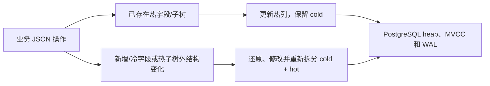

# JSON 更新设计与场景选型

[English](design-rationale.md) | **简体中文** · [文档目录](README.zh-CN.md)

本文解释 **PostgreSQL Split JSON Storage Extension（PG SplitJSON）0.1.0** 的设计选择，起点是尹海文（胖头鱼的鱼缸）于 2026-09-10 发表的[《胖头鱼的技术专栏-468 JSON改一个字段，凭什么要重写整篇？（20260910）》](https://blog.csdn.net/yhw1809/article/details/164757146)。原文讨论高频更新、写放大、关系存储之上的 JSON 访问，以及常变字段拆分。本文将这些思路展开为已实现 PG 扩展的设计说明；项目性能数字仍以验证报告为依据。

## 从文章思路到 PG SplitJSON

值得追问的是：一个小字段发生变化时，存储引擎需要处理多少未变数据？商品库存与价格、订单状态、游戏背包和物流事件让问题具体起来：各字段的更新频率、大小、读取模式和原子性要求都不同。业务用一个 JSON 文档表达它们，并不意味着必须把它们存为一个共同变化的值。

原文给 PostgreSQL 的替代方案是：高频字段拆为普通列，半静态属性保留在 JSONB 中。关于 JSON Relational Duality View 的讨论也体现了更一般的思想：JSON 可以是关系存储之上的应用接口。PG SplitJSON 将这个思想用于同一行内声明的对象及固定数组路径，保留冷文档模板，把每个已存在热值只存一份到独立列，通过业务视图还原文档。

| 原文中的设计思路 | 0.1.0 中的实现 | 边界 |
| --- | --- | --- |
| 常变字段与大属性分开 | 声明的 JSONB 热列 + 冷模板 | 已存在热字段/子树通过专用 API 更新 |
| 应用边界保持 JSON 便利 | 视图提供完整 doc 和业务列 | 完整读取需要还原 doc，集成使用显式 API |
| 直接查询物理列 | 辅助 API、常量路径 SELECT 自动改写和 JSONB/文本 B-tree | 规划前加载模块，不支持的形式保留原生行为 |
| 避免同一值有两份权威副本 | 已存在热路径保存占位符，不复制热值 | 回退写入在事务内同步模板与热列 |
| 独立变化的集合成员独立建模 | 普通关系表可存逐项/逐事件记录 | 未实现数组到子表的自动映射 |

本扩展专注于 JSON 分离存储，通用 duality view 不属于项目范围，不作为后续功能。当前也不提供 JSON Patch 翻译、ETag 或跨表 JSON 构造。`set_fields` 使用自己的顺序 `path`/`value` 格式，既不是 RFC 6902 JSON Patch，也不是 RFC 7396 JSON Merge Patch。

## 物理上改变了什么

对于实际的值变化，PostgreSQL 18 的 `jsonb_set` 会构造结果 JSONB 值。改用 `MERGE` 语法，或者把键移到**同一个 JSONB 值**的顶层，并不构成物理局部写入保证。PG SplitJSON 通过将字段移至另一个 heap 列来改变存储边界。

MVCC 和 TOAST 对应两项不同成本：UPDATE 创建新的 heap 行版本，而未变化的外置值通常可以继续使用原 TOAST 指针。修改 JSONB 值自身可能需要处理和存储新的大值；仅修改独立列则可以保持大冷值不变。[PG18 TOAST 文档](https://www.postgresql.org/docs/18/storage-toast.html)说明了未变值复用，PG SplitJSON 利用这一既有机制，并未绕过 MVCC。



扩展里的“热字段”指经常更新的字段；PG 的 **HOT** 指 Heap-Only Tuple 优化，两者有不同条件。HOT 要求不修改索引引用列（汇总型索引有例外），且新元组能放在同一页。变化热列上的 B-tree 可能阻止 HOT，但仍允许冷 TOAST 复用。因此减少冷值写入并不意味着零 WAL、零索引维护、没有新行版本或不需要 vacuum。详见 [PG18 HOT](https://www.postgresql.org/docs/18/storage-hot.html)和项目物理验证。

## 选择存储模型

| 模型 | 适用情况 | 更新与查询取舍 |
| --- | --- | --- |
| 原生 JSONB | 小型或基本不变文档，现有更新已满足要求 | 原生 JSON 操作与索引简单；变化文档使用原生 JSONB 写入路径 |
| 显式普通列 + JSONB | 稳定模式、类型约束和直接 SQL 访问优先 | 应用或专门视图构造 JSON；热列变化时可不赋值 JSONB |
| PG SplitJSON | 大型半静态负载、少数已知对象/数组热路径、面向 JSON 的应用 | 已存在热字段 API 保留冷值；完整读取和结构变化需还原；查询通过辅助 API 或支持的改写 |
| 规范化子表 + JSON 投影 | 数组或关联实体独立变化 | 逐项/逐事件行可隔离写入与锁；投影和更新映射需另行设计 |

小文档、低频更新可能难以抵消额外布局和还原成本。主要操作若是替换完整文档或向大数组追加内容，往往会走回退路径，采用扩展前应评估原生 JSONB 或独立关系行。原文跨数据库讨论提供了这些设计维度；本文不使用未经核实的存储或吞吐结论给 MongoDB、Oracle 版本排名。

## 按负载选择热路径

从实测更新频率、冷负载大小、字段存在比例和读取模式出发，优先选择稳定、通常已存在、值较小但常变的对象或固定数组路径。很少存在的注册字段在首次创建时需要重新拆分。把大对象或数组整体作为一个热值，其替换仍会重写这个热值；若主要更新集中在某个叶子，应选择更小的叶子路径。

只给确有等值搜索需求的热路径创建索引。存储声明创建独立列，不创建查询索引；B-tree 维护是更新成本，应比较查询收益与更新频率。只需一个字段时使用 `get_field`，避免完整文档还原。

| 原文提及的负载 | 候选热路径 | 可另行处理的内容或模型 |
| --- | --- | --- |
| 商品/SKU | stock、price、status | 描述/规格保持冷存储，tenant/SKU 标识可用类型化业务列 |
| 订单文档 | state、stats.retry_count | 大订单快照保持冷存储，关联商品项可放独立表 |
| 游戏背包 | summary.count、summary.version | 固定叶子或整个热数组子树支持更新；独立元素锁需要分行 |
| 物流 | latest.state、latest.timestamp | 常追加的历史仍会重写其值，可考虑事件表 |
| 半静态配置 | 仅选择确实高频的字段 | 更新稀少时原生 JSONB 可能已经足够 |

热路径不能重叠，同时声明 `stats` 与 `stats.count` 无效，应选择希望替换的单元。修改热字段父路径会回退；已存在热对象/数组的内部子路径可以只更新热列。0.1.0 不支持动态布局变化，应在导入数据前选定路径；后续调整布局使用新的受管目标迁移。

独立热列仍位于**同一个 heap 行**，相同 ID 上的库存与状态更新需要按行锁串行执行。本设计减少冷写入，不消除同一行的锁竞争；希望各项独立写入时，可考虑分行。专用 numeric 增量是原子的，但并不自动保证库存非负、价格小数位等业务规则，若需要数据库强制这些规则，可考虑带显式约束的关系模型或合适的 domain 业务列，并为 JSON 更新设计验证；热 JSONB 值不会自动转换为这些列类型。

## 商品示例

在已安装扩展的测试数据库中由安装者执行。下列示例名称与 README、API 示例独立；小负载用于说明更新路由，不用于演示性能。

```sql
SELECT splitjson.create_table('public.catalog_items',
    '[["stock"],["price"],["status"]]',
    '{"tenant_id":"bigint","sku":"text"}');

INSERT INTO public.catalog_items(id, doc, tenant_id, sku)
VALUES (1,
    '{"stock":100,"price":19.9,"status":"draft","specs":{"color":"blue","size":"M"},"description":"cold product details"}',
    10, 'SKU-001');

-- 已存在热值：库存增量及价格/状态批量更新不改变 cold。
SELECT splitjson.increment_field('public.catalog_items', 1, ARRAY['stock'], 5);
SELECT splitjson.set_fields('public.catalog_items', 1,
    '[{"path":["price"],"value":21.5},{"path":["status"],"value":"active"}]');

SELECT splitjson.create_path_index('public.catalog_items', 'catalog_status_idx', ARRAY['status']);
SELECT id, sku FROM public.catalog_items
WHERE id IN (SELECT splitjson.find_ids('public.catalog_items', ARRAY['status'], '"active"'));
SELECT splitjson.get_field('public.catalog_items', 1, ARRAY['stock']);

-- 冷字段修改：还原并重新拆分，同时保留更新后的库存、价格和状态。
SELECT splitjson.set_field('public.catalog_items', 1, ARRAY['specs','color'], '"green"');
SELECT doc FROM public.catalog_items WHERE id = 1;
```

返回文档包含 stock 105、price 21.5、status active 和 color green；这些字段更新不需要应用先组装完整 JSON。缺失中间对象仍遵循 `jsonb_set` 语义，本例中的 `specs` 已经存在。

## 观察物理表

原文提出的 vacuum 与膨胀问题在扩展中仍然存在，应观察**内部 heap 表**，而不只是业务视图。以下只读查询由安装者执行，因为映射元数据是私有的。继续使用商品示例，不向业务角色开放元数据和内部表。

```sql
SELECT m.view_name, m.storage_name,
       s.n_tup_upd, s.n_tup_hot_upd, s.n_tup_newpage_upd,
       s.n_dead_tup, s.last_autovacuum,
       pg_total_relation_size(s.relid) AS total_bytes
FROM splitjson._tables AS m
JOIN pg_stat_user_tables AS s ON s.relid = to_regclass(m.storage_name)
WHERE m.view_name = 'public.catalog_items';
```

`n_tup_upd` 统计包括 HOT 在内的行更新，`n_tup_hot_upd` 统计 HOT 更新，`n_tup_newpage_upd` 统计后继元组移到其他 heap 页的更新。`n_dead_tup` 是估计值，不是即时精确膨胀量。应比较代表性时间段内的计数差，统计可能延迟或被缓存。`pg_total_relation_size` 包含表、索引与 TOAST 存储。参见 [PG18 统计文档](https://www.postgresql.org/docs/18/monitoring-stats.html)。

autovacuum 参数应依据实际更新速率、表大小、长事务快照和 I/O 能力选定。降低 `autovacuum_vacuum_scale_factor` 可以更早触发 vacuum，但不会消除 JSONB 重组成本或保证无膨胀。实现以 fillfactor 70 创建内部表，为更新留空间，但不保证 HOT。固定 4 KiB 文档上限或统一 0.05 scale factor 不是扩展规则；TOAST 决策取决于行宽、可压缩性和存储设置。参见 [PG18 常规 vacuum](https://www.postgresql.org/docs/18/routine-vacuuming.html)。

## 评估完整负载

用相同数据与等价索引比较原生 JSONB、显式列拆分和 PG SplitJSON，分别测量单字段、全热批量、混合/结构更新及完整文档读取，并覆盖独立提交、同 ID/不同 ID 并发写，以及热列有无索引。现有 WAL 对照测量的是一个具体负载，不包含这些全部维度。

长期观察延迟和吞吐、WAL 字节、heap/索引/TOAST 大小、HOT 比例、锁等待和 vacuum 行为。确认应用更新确实符合快速路径条件，使用 `explain_find_ids` 检查查询计划。WAL 记录数、WAL 字节、脏块和物理设备写入量是不同指标；第三方的记录数或块数不能直接与本项目的 WAL 字节实验比较。


已实现数组操作、查询形式及回退边界见[数组与查询指南](roadmap.zh-CN.md)。

## 资料来源

- [尹海文原文，2026-09-10](https://blog.csdn.net/yhw1809/article/details/164757146)：业务场景、字段拆分与 JSON 访问层思想。
- [PostgreSQL 18 JSON 类型](https://www.postgresql.org/docs/18/datatype-json.html)：JSONB 与整行并发控制。
- [PostgreSQL 18 TOAST](https://www.postgresql.org/docs/18/storage-toast.html) 与 [HOT](https://www.postgresql.org/docs/18/storage-hot.html)：未变外置值复用与 heap 更新/索引成本。
- [PostgreSQL 18 分支 jsonfuncs.c](https://github.com/postgres/postgres/blob/REL_18_STABLE/src/backend/utils/adt/jsonfuncs.c)：jsonb_set 构造结果 JSONB，不提供已存值的字节补丁接口。
- [PostgreSQL 18 统计](https://www.postgresql.org/docs/18/monitoring-stats.html)与[常规 vacuum](https://www.postgresql.org/docs/18/routine-vacuuming.html)：统计解释与维护。
- PG SplitJSON 验证报告和 [API 参考](api-reference.zh-CN.md)：实测行为与 0.1.0 约定。
